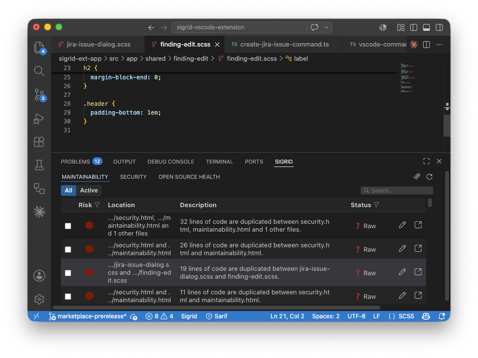
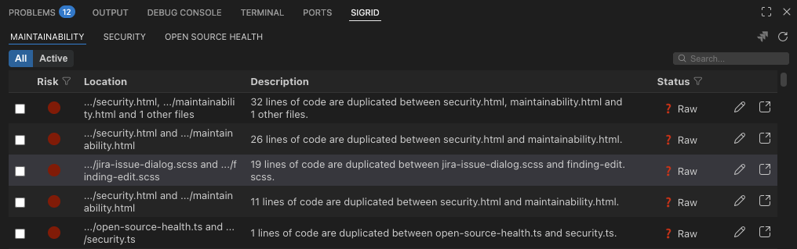
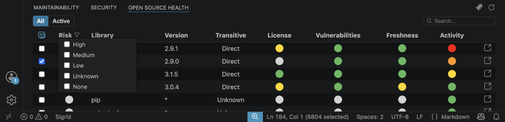
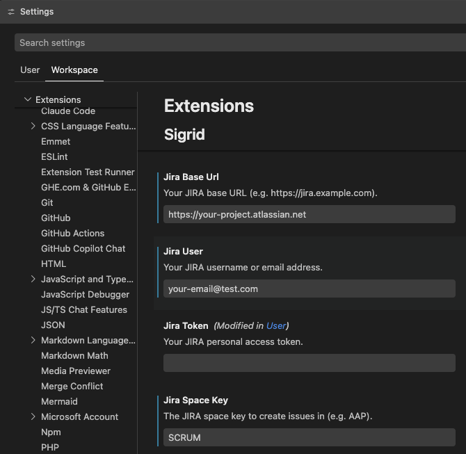

# Sigrid (Visual Studio Code)

A Visual Studio Code extension that brings Sigrid findings directly into your editor via a lightweight dashboard.

> 🚀 Use the **Sigrid: Show Findings** command to open an interactive webview panel with security, maintainability, and other findings powered by your Sigrid account.

---

## ✅ Features

- **View Sigrid findings in VS Code** without leaving your editor
- **Search and filter findings** directly within the Sigrid dashboard
- **Interactive dashboard** with filtering, navigation, and table controls
- **Deep link** from findings to the Sigrid web UI
- **Configurable Sigrid instance URL** (supports self-hosted deployments)
- **Create Jira issues** from selected findings (when JIRA settings are configured)
- **Create Azure DevOps work items** from selected findings (when Azure DevOps settings are configured)
- **Fix with AI** — hand selected findings off to a detected coding agent (Claude Code or GitHub Copilot Chat) with a generated prompt, referencing the Sigrid MCP server when available






---

## ⚙️ Requirements

This extension requires a valid Sigrid account and API credentials.

You will need:

1. A **Sigrid API Key**
2. Your **Sigrid Portfolio Name**
3. Your **Sigrid System ID**

If you don’t have these values, contact your Sigrid administrator or refer to your Sigrid documentation.

---

## 🚀 Getting Started

1. Install the extension in VS Code.
2. Open **Settings** and set the following configuration values:
   - `sigrid-vscode.apiKey` – your Sigrid API key
   - `sigrid-vscode.portfolioName` – your Sigrid portfolio name (customer ID)
   - `sigrid-vscode.system` – your Sigrid system ID
   - `sigrid-vscode.subsystem` - (optional) your Sigrid subsystem ID
   - `sigrid-vscode.sigridUrl` – (optional) your Sigrid instance URL. Defaults to `https://sigrid-says.com`.
3. Open the Command Palette (`Cmd+Shift+P` / `Ctrl+Shift+P`) and run:
   - **Sigrid: Show Findings**

---

## 🧩 Extension Settings

### General Settings

This extension contributes the following Sigrid-related settings:

| Setting | Description |
|--------|-------------|
| `sigrid-vscode.apiKey` | Your Sigrid API Key. |
| `sigrid-vscode.portfolioName` | Your Sigrid Portfolio Name (formerly `customer`). |
| `sigrid-vscode.system` | Your Sigrid System ID. |
| `sigrid-vscode.subsystem` | Your Sigrid Subsystem ID (optional). |
| `sigrid-vscode.sigridUrl` | The URL of your Sigrid instance (default: `https://sigrid-says.com`). |

### Jira Settings

These settings are required only if you want to create Jira issues from Sigrid findings:

| Setting | Description |
|--------|-------------|
| `sigrid-vscode.jiraBaseUrl` | Your JIRA base URL (e.g. `https://jira.example.com`). |
| `sigrid-vscode.jiraUser` | Your JIRA username or email address. |
| `sigrid-vscode.jiraToken` | Your JIRA personal access token. |
| `sigrid-vscode.jiraSpaceKey` | The JIRA space key to create issues in (e.g. `AAP`). |



### AI Agents Settings

These settings control how "Fix with AI" hands findings off to Claude Code:

| Setting | Description |
|--------|-------------|
| `sigrid-vscode.claudeCodeHandoff` | How Sigrid hands findings to Claude Code: `extension` (default) opens the Claude Code panel with the prompt prefilled for review; `terminal` types the prompt into a terminal and runs it immediately. Falls back to a terminal automatically when the Claude Code extension is not installed. |

GitHub Copilot Chat is detected automatically and requires no additional configuration.

### Azure DevOps Settings

These settings are required only if you want to create Azure DevOps work items from Sigrid findings:

| Setting | Description |
|--------|-------------|
| `sigrid-vscode.azureDevOpsOrganizationUrl` | Your Azure DevOps organization URL (e.g. `https://dev.azure.com/myorg` or `https://myorg.visualstudio.com`). |
| `sigrid-vscode.azureDevOpsPersonalAccessToken` | Your Azure DevOps personal access token. |
| `sigrid-vscode.azureDevOpsProjectName` | The Azure DevOps project to create work items in (e.g. `MyProject`). |

---

## 🛠 Development

To build and test the extension locally:

```bash
npm run install:all
npm run build:webview
npm run compile
```

To start a watch build while developing:

```bash
npm run watch
```

To run the extension in VS Code for debugging:

1. Open this repository in VS Code.
2. Press `F5` to start the Extension Development Host.

To build a Visual Studio Code VSIX package file:

```bash
npm run install:all
npm run package
```

---

## 🐞 Known Issues

- If the panel stays blank, verify that your API credentials are correct and that your network allows requests to your Sigrid instance.
- In the Maintainability and Open Source Health tabs, opening issues in Sigrid may not navigate to the exact finding.

---

## 📄 Release Notes

See [CHANGELOG.md](./CHANGELOG.md) for a full history of changes.

---

## 📚 More Information

* [Extension documentation](https://docs.sigrid-says.com/integrations/vscode-extension.html)
* [VS Code Extension API](https://code.visualstudio.com/api)
* [Sigrid Software Assurance Platform](https://sigrid-says.com/)
* [Sigrid documentation](https://docs.sigrid-says.com/)
